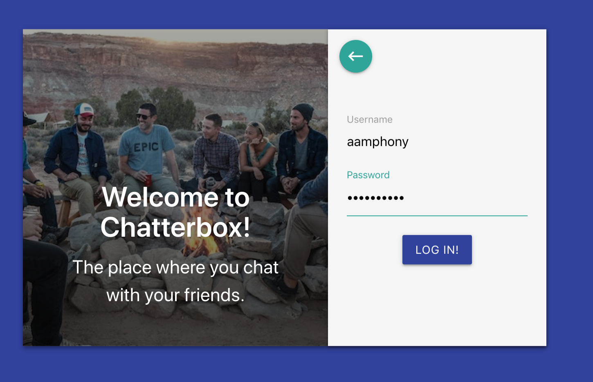
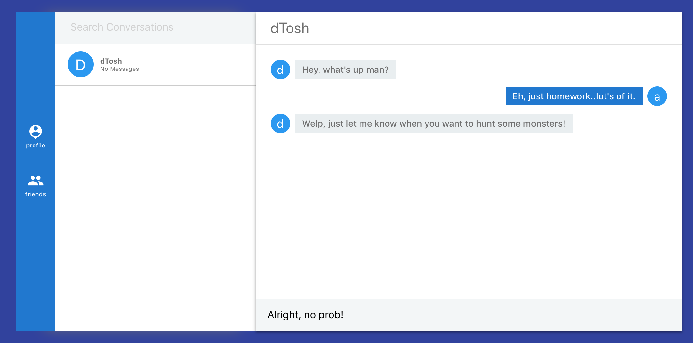
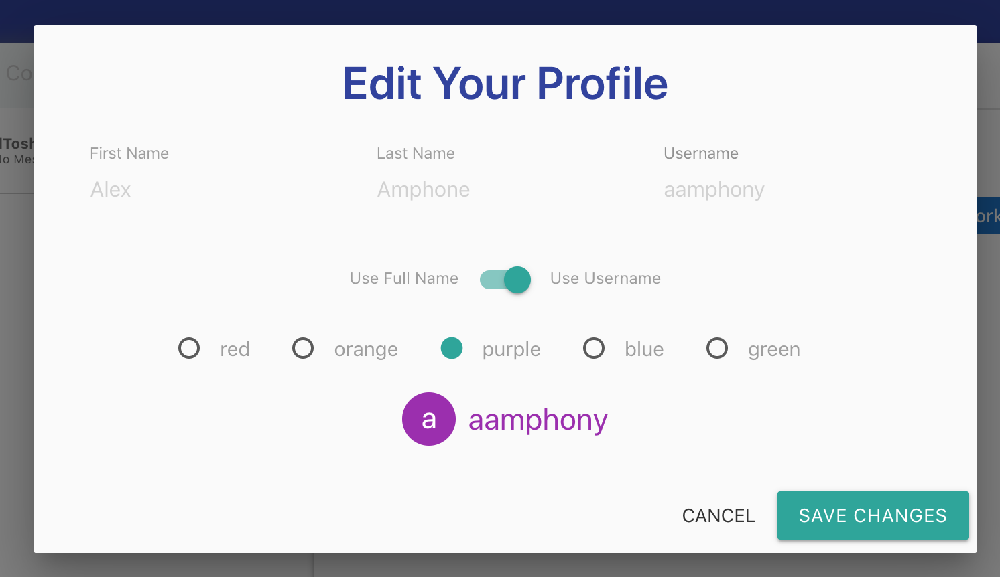

# Chatterbox

Real time chat application that allows for simple messaging between users [WIP]

## Foreword

Chatterbox is a personal project I created to explore technologies like React and Socket.io. It also helped me reinforce concepts in REST APIs, state management, and user authentication. A great learning experience to say the least.

## App Screenshots

### Login Page

### Main Screen

### Editing Profile

## Built With

* [React](https://reactjs.org/) - Frontend Framework
* [Redux](https://redux.js.org/) - State Manager
* [Socket.io](https://socket.io/docs/) - Used to enable real-time communication between client and server
* [Node](https://nodejs.org/en/docs/) - Used for server
* [MongoDBAtlas](https://www.mongodb.com/cloud/atlas) - Database Cloud Solution

## Authors

* **Alex Amphone** - [chatterbox](https://github.com/amphony/chatterbox)

## License

This project is licensed under the MIT License - see the [LICENSE.md](LICENSE.md) file for details
